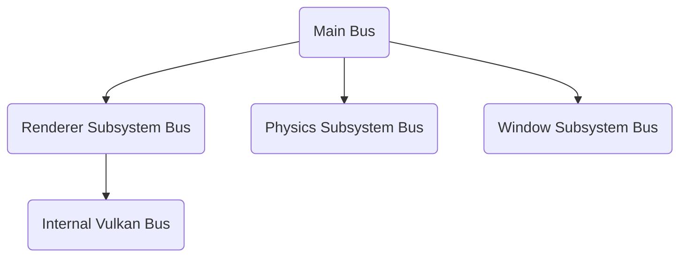
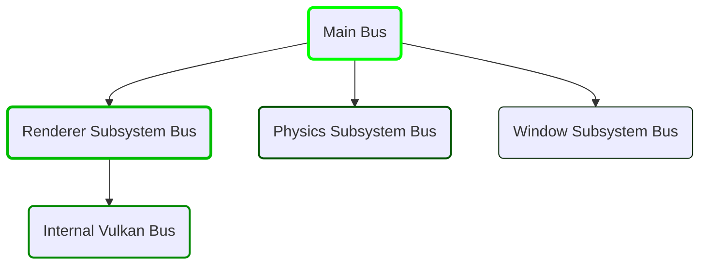
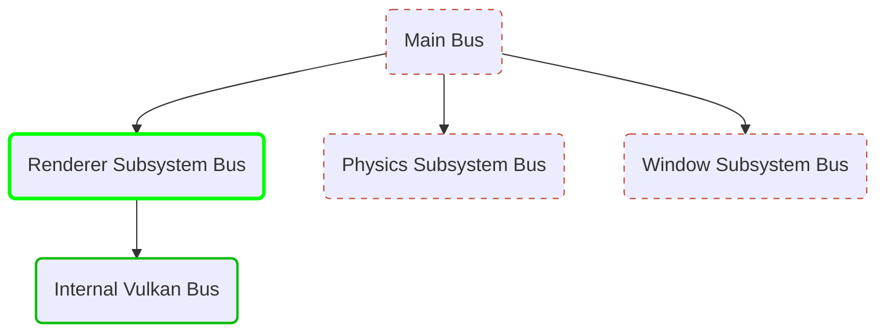

Magistrala eventów pozwala na publikację zdarzeń w silniku, przykładowo: 
* zminimalizowanie okna,
* rozpoczęcie zamykania silnika,
* Zmiana kontekstu sceny,


Tworzenie eventów odbywa się poprzez deklaracje za pomocą dwóch makr
```
// Deklaracja lokalnego eventu "MyLocalEvent" zawierającego pojedyńczą zmienną
BEGIN_LOCAL_EVENT_DEFINITION(MyLocalEvent)
    uint32_t MyNumber;
END_EVENT_DEFINITION  

// Deklareacja globalnego eventu "OurGlobalEvent" zawierającego dwie zmienne
BEGIN_GLOBAL_EVENT_DEFINITION(OurGlobalEvent)
    std::string Text;
    bool IsDeepEngineCool = true;
END_EVENT_DEFINITION
```

## Eventy Globalne
Eventy publikowane wśród wszystkich magistrali począwszy od najwyższej w hierarchii.

Gdy jakikolwiek listener zablokuje dalsze 

## Kolejność Publikacji
Publikacja eventu zachodzi od **najwcześniej** do **najpóźniej** utworzonych sub-magistrali!
Przykład: 


#### Publikacja Globalnego Eventu
Gdy publikacja globalnego eventu nastąpi w którejkolwiek magistrali:


 > Przy czym najpierw nastąpi wywołanie wszystkich listenerów z danej magistrali, a dopiero potem przejdzie do następnej


#### Publikacja Lokalnego Eventu
Gdy publikacja lokalnego eventu nastąpi w **Renderer Subsystem Bus** kolejność będzie wyglądać następująco:


 > Przy czym najpierw nastąpi wywołanie wszystkich listenerów z danej magistrali, a dopiero potem przejdzie do następnej
 
 > Magistrale oznaczone przerywaną linią zostały wykluczone, ponieważ znajdowały się ponad scopem `Renderer Subsystem Bus`


